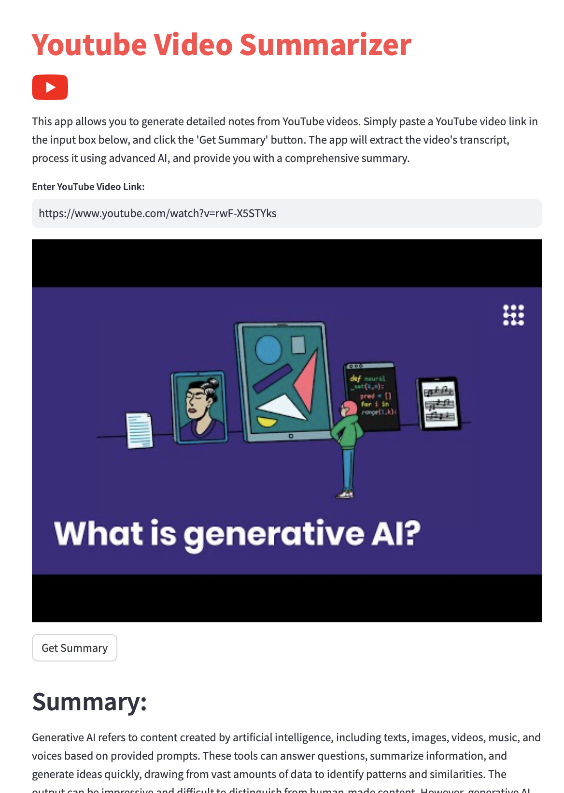

# YouTube Video Summarizer

## Overview

YouTube Video Summarizer is a application that generates concise summaries of YouTube videos by leveraging the power of OpenAI's GPT-3.5-turbo model. This app extracts key points and main ideas from video transcripts, providing users with quick insights into video content.



## Features

- Extract transcripts from YouTube videos in multiple languages
- Generate AI-powered summaries of video content
- User-friendly interface built with Streamlit
- Support for various YouTube video URL formats

## Installation

1. Clone this repository:
   ```
   git clone https://github.com/yourusername/youtube-video-summarizer.git
   cd youtube-video-summarizer
   ```

2. Create a virtual environment (optional but recommended):
   ```
   python -m venv venv
   source venv/bin/activate  # On Windows, use `venv\Scripts\activate`
   ```

3. Install the required packages:
   ```
   pip install -r requirements.txt
   ```

4. Set up your OpenAI API key:
   - Create a `.env` file in the project root
   - Add your OpenAI API key to the file:
     ```
     OPENAI_API_KEY=your_api_key_here
     ```

## Usage

1. Run the Streamlit app:
   ```
   streamlit run youtube_summarizer/crsr_video_sum.py
   ```

2. Open your web browser and go to the URL provided by Streamlit (usually `http://localhost:8501`)

3. Enter a YouTube video URL in the input field

4. Click the "Get Summary" button to generate a summary of the video content

## How It Works

1. The app extracts the video transcript using the YouTube Transcript API
2. The transcript is then sent to OpenAI's GPT-3.5-turbo model along with a custom prompt
3. The AI generates a concise summary of the video content
4. The summary is displayed to the user in the Streamlit interface

## Dependencies

- streamlit
- openai
- youtube-transcript-api
- python-dotenv

For specific version requirements, see `requirements.txt`.


